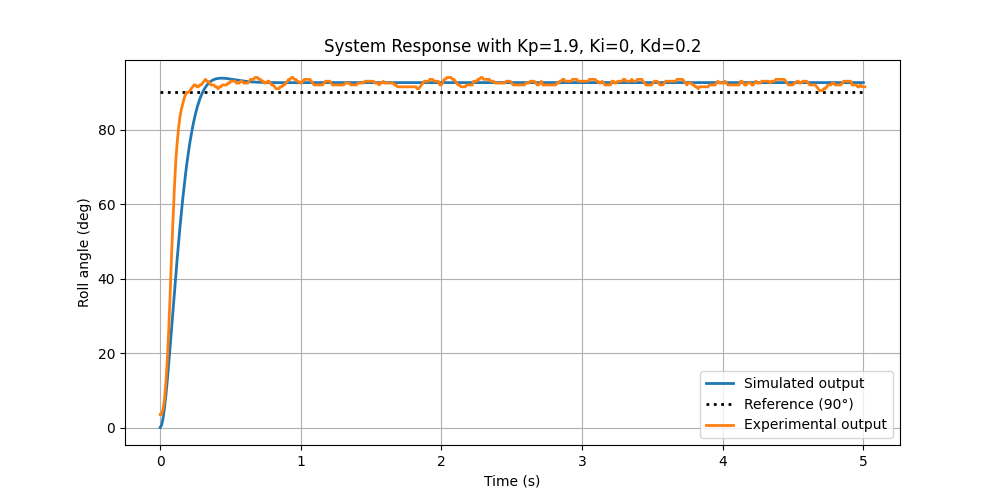

# ENEL321 Control Systems Rocket Lab

Take a given transfer function for rocket roll angle and input disturbance
with PID control, plot the simulated step response against experimental
step response, and calculate the time domain specifications for both.

## Example Output


```text
Results for Kp=1.9, Ki=0, Kd=0.2:

Val             Exp             Sim
ζ               -               0.8
Mp%             4.4 %           4.2 %
e_ss            2.1 deg         2.6 deg
t_r             0.20 s          0.19 s
```